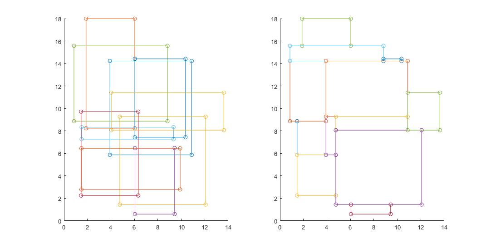

This program uniformally generates random points within given rectangles. The given rectangles are aligned with x, y axes, and they may overlap. 

The algorithm first truncates overlapped rectangles into non-overlapped rectangle areas using [line sweep](https://en.wikipedia.org/wiki/Sweep_line_algorithm). Then it generates random points uniformally from those areas. The truncated areas looks like below:

